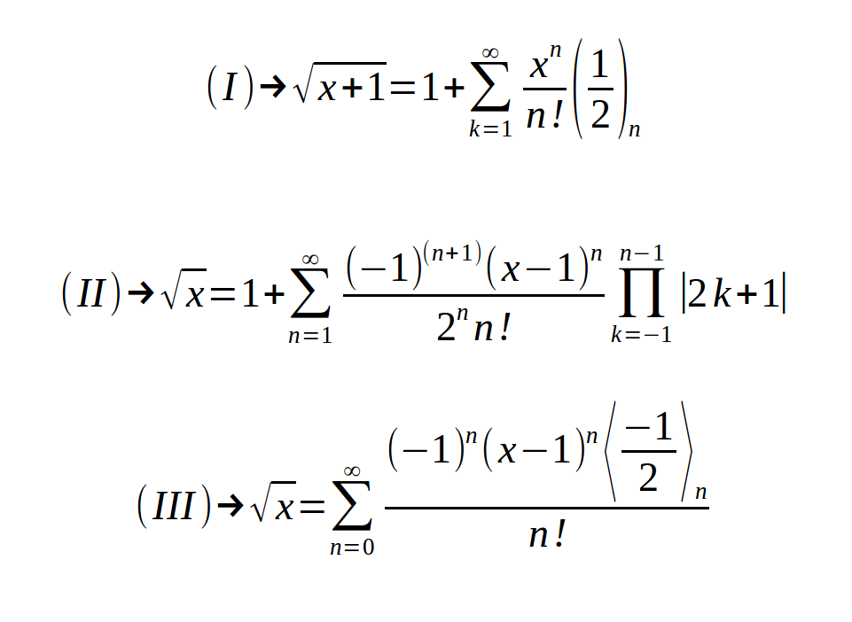

# sqrt-aprox

__*Abstract*__: The coding focus is a implementation in C of heuristics solutions using p-series to evaluate _f(x) = sqrt(x)_. All this is for a college engineer project.

## Some series to inspiring the code (series to do this approximation)

In order the series:
  * _(I)_ My own series whose i found with my hands before an odd notice... (was not necessary)
  * _(II)_ The series than Prof. Sávio give us and Gabriel it's not a her fan [*1*]
  * _(III)_ The second series approximation we see in platform of mathematics [wolfram](http://www.wolframalpha.com/share/clip?f=d41d8cd98f00b204e9800998ecf8427ek7hsa4aeht) ! [*2*]

##  Observations
  * Here is a documentation about of rising factorial, whose the notation of *Pochhammer* for denote in series (II) and (III): [*Pochhammer Symbol*](http://mathworld.wolfram.com/PochhammerSymbol.html)
    1. (II)  [*Falling Factorial*](http://mathworld.wolfram.com/RisingFactorial.html)
    2. (III) [*Rising Factorial*](http://mathworld.wolfram.com/FallingFactorial.html)

## Contributing

1. Fork it!
2. Create your feature branch: `git checkout -b my-new-feature`
3. Commit your changes: `git commit -am 'Add some feature'`
4. Push to the branch: `git push origin my-new-feature`
5. Submit a pull request :D

## History

We have a problem with the diverge output results of input values __**n** > 2__. It's frustrating. For it, the focus of the problem will be to restrict the input a fix value _**z** = 50_ and after that transform it in: _**z**^(1/2) -> **k**(1 + **x**)^(1/2)_. In other words, we need factoring _√50 -> 5√2_! some things were made in Python for prototype the solution, but the implementation mission is in C ANSI!

## Credits

Contributors:
  * Me (Manoel Vilela)
  * Gabriel Giordano (guest)
  * Janderson Souza
  * Núria Rocha
  * Júliana Azevedo
  * Jeanderson Oliveira

## License

GPL License

## Roadmap
  - [X] Structure of algorithm and basic ideas to implement
  - [X] Construct the function in C to return the form square root factored 
  - [X] Implementation of a series convenient (i did implement three!)
  - [X] Test series of your convergence in an input (the prototype of tests was made)
  - [X] Do the tests that our **beloved** professor wants (error estimative)
  - [X] Discover the bug-enigma in implementation on C of the three series divergence.
    - [X] Fix the (I) series implementation -> *man_serie()*
    - [X] Fix the (II) series implementation -> *sav_serie()*
    - [X] Fix the (III) series implementation -> *wolf_serie()*
  - [X] Fix all the divergence of the series in implementation!